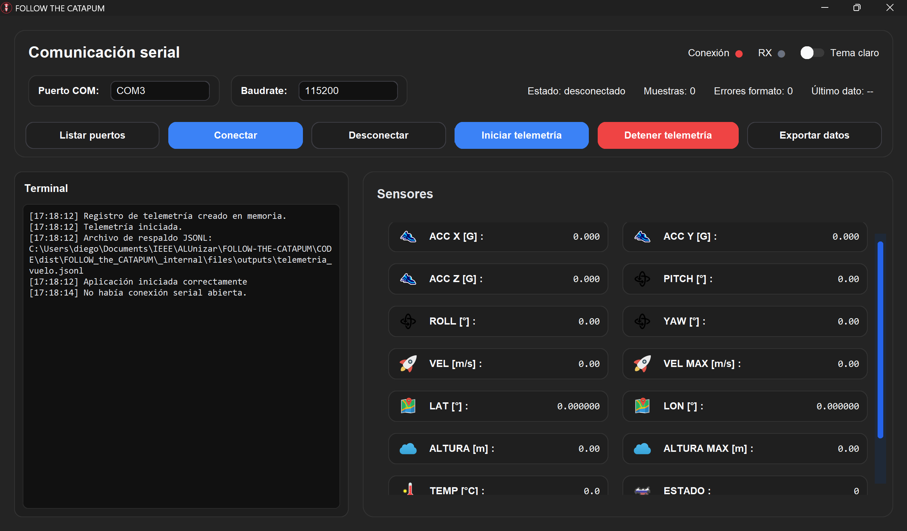

# FOLLOW THE CATAPUM

Aplicación de escritorio para **visualizar y registrar la telemetría** de cohetes de modelismo.
Recibe datos enviados por un ESP32 a través del puerto serie, muestra las lecturas en tiempo real y permite guardarlas para analizarlas después.

## Vista de la aplicación

<!-- Añade una captura en docs/img/interfaz.png o cambia esta ruta por la de tu imagen. -->

## ¿Qué hace?

- Muestra en pantalla los valores de los sensores y los mensajes de la terminal.
- Permite seleccionar el puerto COM y la velocidad de comunicación con el ESP32.
- Lee una muestra puntual o inicia una lectura continua.
- Indica el estado de la conexión, las muestras recibidas y los errores de formato.
- Guarda cada muestra en **JSONL** y exporta los datos a **CSV** y **Excel**.
- Incluye un **modo prueba** para generar datos simulados.

## Uso básico

1. Conecta el ESP32 al ordenador y pulsa **Listar puertos** para identificar su puerto COM.
2. Introduce el puerto y el *baudrate* correspondiente y pulsa **Conectar**.
3. Pulsa **Leer dato** para recibir una muestra o **Iniciar telemetría** para comenzar la lectura continua.
4. Pulsa **Detener telemetría** al terminar. La aplicación exportará el registro a CSV y Excel; también puedes usar **Exportar datos** en cualquier momento.

Para probar la interfaz sin el ESP32, activa **Modo prueba** antes de iniciar la lectura. Los mensajes recibidos por el puerto serie deben ser objetos JSON, uno por línea.
